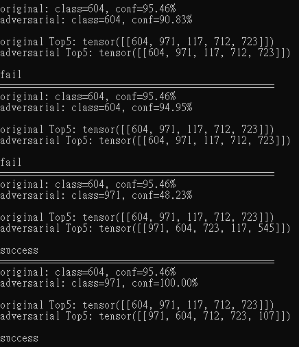

# Spoof CNN vision
by adding high-frequency signals to the image to spoof CNN(Resnet50) vision.

# Usage
1. put `original.jpg` and python files in same folder
2. run this and wait:
```python
python main.py
```
3. to check image effect:
```python
python check.py
```
4. to see how different they are:
```python
python diff.py
```

---



---

Made with ❤️ by [4nyth1ng](https://github.com/4nyth1ng).
