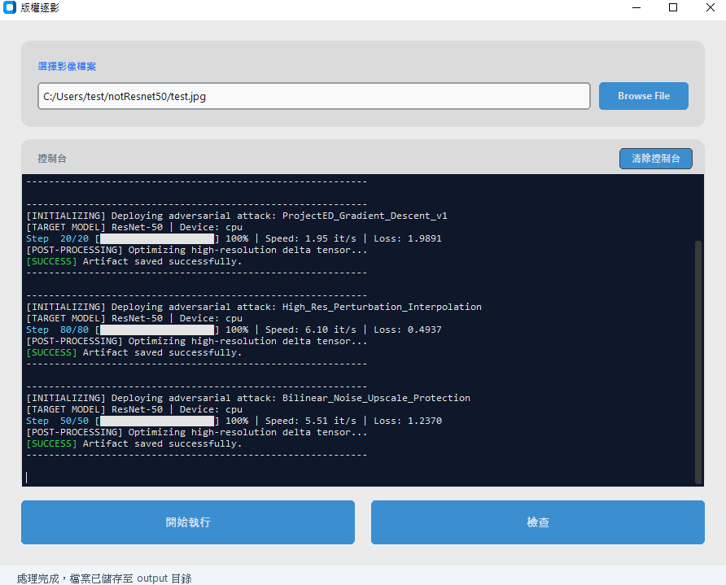
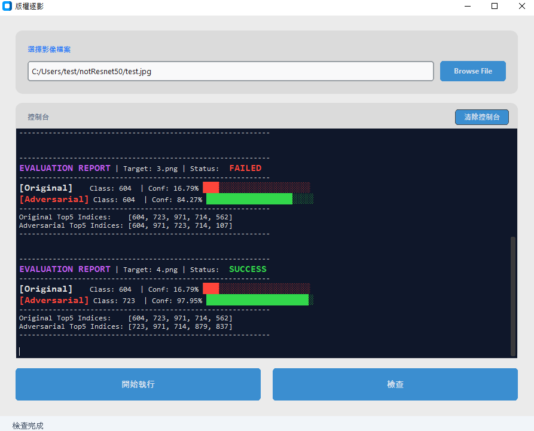

# 基於高頻訊號的 CNN 視覺欺騙
本專案透過在原始影像中植入特定的高頻雜訊(對抗性擾動)，藉此干擾並欺騙卷積神經網路(以 ResNet-50 為例)的視覺辨識結果。\
專案內共包含 4 種版本的實作演算法，其中 Version 4 (v4) 具備最佳的欺騙效果與影像隱蔽性。

# 系統需求與安裝說明
在開始執行本專案之前，請確保您的開發環境已安裝所有必要的相依套件。
1. 安裝相依套件
```python
pip install -r requirements.txt
```
2. 請將該影像檔案與本專案的 Python 原始碼檔案放置於同一個資料夾目錄下。

# 使用方法
1. 啟動圖形化使用者介面(GUI)
```python
python main.py
```
2. 影像比對與分析
 - 若欲觀看對抗樣本(干擾後影像)與原始影像之間的差異程度，雜訊分布或辨識置信度變化，請點擊介面中的 Check 按鈕運行比對腳本。

---



---

Made with ❤️ by [4nyth1ng](https://github.com/4nyth1ng).
